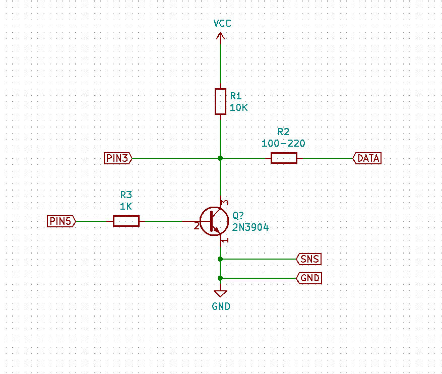

# KFD-AVR

A fork of the amazing [KFDTool](https://github.com/KFDTool/KFDTool) software for an Arduino, plus schematics and board files for a shield.

Completed shields can be purchased from the [online store](https://store.omahacommunicationsys.com)

Note: You must use the build of the KFDTool software attached to this GitHub repo in order for your homebrew adapter to work. The stock KFDTool software will not find your Arduino.

Currently, the following boards have been tested and confirmed to work:

* Arduino Uno (and clones)
* Arduino Uno R3 (and clones)
* Arduino Mega 2560 (and clones)

The following boards should work, however have not been tested:

* Arduino Leonardo (and clones)
* Arduino Pro Micro (and clones)
* Arduino Nano (and clones)
* Basically anything using an ATMega328p, 2560, 32u4, or 16u2

The following boards have been reported to work with minor modifications:

* LGT8F328P - need to adjust frequency and remove all of the EEPROM references

Further testing and problem reporting by the community is encouraged to further improve compatibility with other devices.

## Setup/Installation

Setup consists of three parts.

1. Hardware Setup
2. Firmware Flashing
3. Software Setup

### Hardware Setup

The hardware for the KFD-AVR fork is very simple. You can either purchase a KFDShield from the [online store](https://store.omahacommunicationsys.com), or build your own circuit on a breadboard. The bare minimum you need to get going is this:

Where PIN3 is Arduino pin 3, PIN5 is Arduino pin 5, DATA is the radio data line, SNS, is the radio sense line, and GND is the radio ground line. VCC is 5 volts (make sure you are using a 5 volt tolerant board).

If you are using a shield, on the TRS connector, tip is data, ring is sense, and shield is ground.

### Firmware Flashing

Head to the Releases page and download both the Firmware and Software zips from the latest version. Save the software for later. Unzip Firmware, and open the kfd-avr.ino file in the Arduino IDE, and select your board type and COM port from the Tools menu. If you are using a board that is not explicitly supported, or DIYing your own rather than using a shield, you should confirm that all options in the hal.h file are correct - namely, CPU speed and data/LED pins. Once you are done, hit upload.

### Software Setup

The software distributed with the KFD-AVR release is "flat pack", meaning there is no installer supplied - all you need to do to run the software is unzip the Software zip and run the KFDToolGui.exe file. You may see an "Error - timeout while waiting for data" when first opening the software. **This is completely normal, especially if you have many COM ports on your system. The warning will be suppressed in a future release.** Select the COM port corresponding to your Arduino, and you should see information populate in the bottom bar of the screen indicating that the KFDTool software is connecting to your Arduino.

In order to validate that every part of the chain - hardware, firmware, and software - is working, go to the Utility - Adapter Self Test menu, and click "Detect MR". This will send a signal to your radio asking it to reply and confirm it is there. If you get a success message, congrats! You are ready to load keys.

# Original Readme:

Open Source P25 Key Fill Device

Compliant with P25 standards (TIA-102.AACD-A)

Purchase Hardware: [online store](https://kfdtool.com/store)

Download Software: [latest release](https://github.com/KFDtool/KFDtool/releases)

Release Notifications: [subscribe](https://kfdtool.com/newsletter)

Demonstration: [video](https://www.youtube.com/watch?v=Oioa3xTQoE0)

Software Manual: [view](doc/KFDtool_Manual.pdf)

Security Considerations: [view](doc/SECURITY_CONSIDERATIONS.md)

Features
--------

**Key Fill Device (KFD)**

The KFDtool software supports KFD features through the KFDtool hardware adapter (TWI/3WI/Three Wire Interface), as well as through a IP (UDP) connection (DLI/Data Link Independent interface).

Keys and groups of keys can be saved to an AES-256 encrypted key container file, which can then be selected and loaded into a target device in one operation.

Supported Manual Rekeying Features (TIA-102.AACD-A)

* 2.3.1 Keyload
* 2.3.2 Key Erase
* 2.3.3 Erase All Keys
* 2.3.4 View Key Info
* 2.3.5 View Individual RSI
* 2.3.6 Load Individual RSI
* 2.3.7 View KMF RSI
* 2.3.8 Load KMF RSI
* 2.3.9 View MNP
* 2.3.10 Load MNP
* 2.3.11 View Keyset Info
* 2.3.12 Activate Keyset

Motorola refers to the P25 standard 3 wire interface (3WI) keyload protocol as ASTRO 25 mode or CKR mode.

The legacy Motorola proprietary keyloading formats SECURENET and ASN (Advanced SECURENET) are **NOT** supported by KFDtool. PID mode is also used to refer to ASN mode.

Key validators/generators are available for the following algorithms:

* AES-256 (Algorithm ID 0x84)
* DES-OFB (Algorithm ID 0x81)
* DES-XL (Algorithm ID 0x9F)
* ADP/RC4 (Algorithm ID 0xAA)

**Mobile Radio (MR) Emulator**

The KFDtool software only supports MR Emulator features through the KFDtool hardware adapter (TWI/3WI/Three Wire Interface) at this time.

This mode allows another keyloader to be connected to the KFDtool, and the keys retrieved.

Supported Manual Rekeying Features (TIA-102.AACD-A)

* 2.3.1 Keyload

Radio Compatibility
-------------------

*Any statements of compatibility do not imply endorsement by the vendor. Testing has not been performed by the vendor themselves.*

**A detailed list of compatible radios and adapters is available [here](doc/RADIO_COMPATIBILITY.md).**

Radios that are compatible with Motorola KVL3000/KVL3000+/KVL4000/KVL5000 keyloaders in ASTRO 25 mode should be compatible with KFDtool.

Keyloading cables made for other radios with MX (Motorola KVL) connectors can be modified by soldering an AC101 or AC102 Hirose pigtail in parallel with the MX connector according to [these](doc/MX_CONN_MOD_NOTES.md) instructions.

Operations encapsulated with encryption (commonly referred to as FIPS mode) are not supported at this time for either the KFD or MR emulation modes.

Hardware
--------

Assembled and tested KFDtool hardware is available from me directly. I can ship internationally. Please visit the [online store](https://kfdtool.com/store) to place an order.

**Proceeds from hardware sales enables me to further develop the software.**

| Part Number | Description |
| :---: | --- |
| KFD100 | Single Hirose port USB key fill device (includes 1 m / 3 ft USB A to USB B cable) |
| AC100 | 6 pin male plug Hirose to 6 pin male plug Hirose cable (0.5 m / 1.5 ft) |
| AC101 | 6 pin male plug Hirose pigtail for custom cables (0.5 m / 1.5 ft) |
| AC102 | 6 pin female jack Hirose pigtail for custom cables (0.5 m / 1.5 ft) |
| AC103 | Motorola R2670 compatible adapter (0.15 m / 6 in) |
| AC104 | Kenwood KPG-115 compatible adapter (0.15 m / 6 in) |
| AC105 | 4 way female jack passive Hirose splitter |
| AC106 | Kenwood KPG-93 compatible adapter (0.15 m / 6 in) |
| AC107 | Motorola XTS4000 compatible adapter (0.15 m / 6 in) |
| AC108 | Aeroflex/IFR 2975 compatible adapter (0.15 m / 6 in) |
| AC109 | Harris XG-100P/XL-150P/XL-185P/XL-200P compatible adapter |

OS Compatibility
----------------

* KFDtool software supports 32-bit and 64-bit Windows 7, Windows 8.1, and Windows 10

* The .NET Framework 4.7.2 or later compatible must be installed

* **The use of a virtual machine with USB passthrough is NOT supported at this time**
    * Changing the USB controller from USB 2.0 mode to USB 3.0 mode has been reported to resolve the issue
    * Do not attempt to update the adapter firmware or initialize an adapter using USB passthrough

Documentation
-------------

* [Software Changelog](doc/SW_CHANGELOG.txt)
* [Firmware Changelog](doc/FW_CHANGELOG.txt)
* [Hardware Changelog](doc/HW_CHANGELOG.txt)
* [Radio Compatibility](doc/RADIO_COMPATIBILITY.md)
* [TWI Cable Assembly Notes](doc/TWI_CABLE_ASSY_NOTES.md)
* [MX Connector Modification Notes](doc/MX_CONN_MOD_NOTES.md)
* [Developer Notes](doc/DEV_NOTES.md)
* [Security Considerations](doc/SECURITY_CONSIDERATIONS.md)

Contributors
------------

* [Daniel Dugger](https://github.com/duggerd)
* [Matt Ames](https://github.com/mattames)

License / Legal
---------------

KFDtool software, firmware, and hardware is distributed under the MIT License (see [LICENSE.txt](LICENSE.txt)).

KFDtool is a trademark of Florida Computer and Networking, Inc.

All product names, trademarks, registered trademarks, logos, and brands are property of their respective owners. All company, product, and service names used are for identification purposes only. Use of these names, trademarks, logos, and brands does not imply endorsement.

Note about hardware:

I request that no one else manufactures identical or compatible units **and sells them to others while I am still doing so** - I have put quite a bit of my own money into developing this hardware. I am totally fine with someone making a unit for themselves or a couple of extras to give to their friends, just that they don't charge for them. Proceeds from hardware sales enables me to further develop the software.

Included open-source components:

Software (see [doc/SW_LICENSE.txt](doc/SW_LICENSE.txt)):

* [NLog](https://github.com/NLog/NLog) - MIT License
* [Mono.Options](https://github.com/mono/mono/blob/master/mcs/class/Mono.Options/Mono.Options/Options.cs) - MIT License
* [HidLibrary](https://github.com/mikeobrien/HidLibrary) - MIT License
* [Microsoft Reference Source](https://github.com/microsoft/referencesource) - MIT License
* [InnovasubBSL430](https://github.com/corentinaltepe/InnovasubBSL430) - GPL v3+ License
* Texas Instruments - BSD 3 Clause License

Firmware (see [doc/FW_LICENSE.txt](doc/FW_LICENSE.txt)):

* Texas Instruments - BSD 3 Clause License
